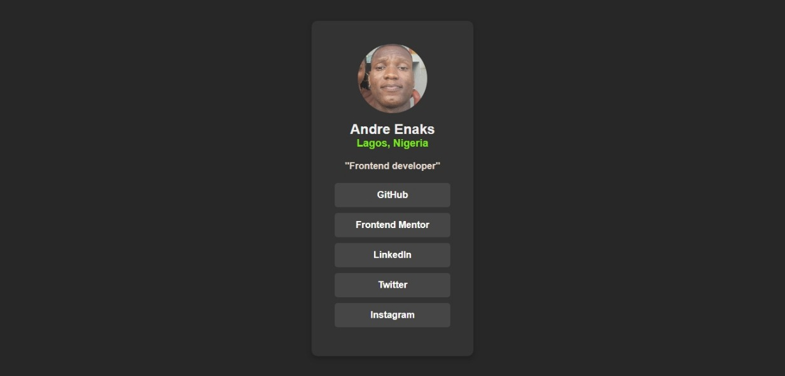
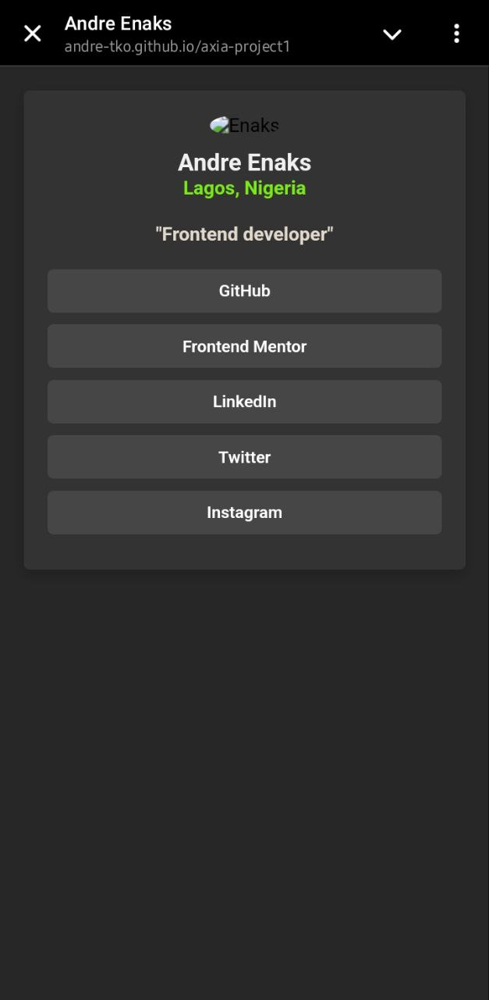

# axia-project1
# Portfolio Website

This is a personal portfolio webpage built using HTML and CSS. It showcases my profile, job role, and social media links.

## Table of Contents

- [Overview](#overview)
- [Project Features](#project-features)
- [Screenshots](#screenshots)
- [Live Demo](#live-demo)
- [Built With](#built-with)
- [Installation](#installation)
- [Author](#author)

## Overview

### Project Features

- A clean and modern design
- Responsive layout for desktop and mobile views
- Social media links that open in new tabs
- Profile section with an image, name, and job role

### Screenshots

#### Desktop View

#### Mobile View

### Live Demo

- Live Site URL: [andre-tko/axia-project1](https://andre-tko.github.io/axia-project1/)

## Built With

- HTML5
- CSS3
- Flexbox
- Media Queries (for responsiveness)

## Installation

1. Clone this repository:
   `sh
   git clone https://github.com/andre-tko/axia-project.git

## Author

- Frontend Mentor - [@andre-tko](https://www.frontendmentor.io/profile/andre-tko)
- Twitter - [@andre_tko](https://x.com/andre_tko)
